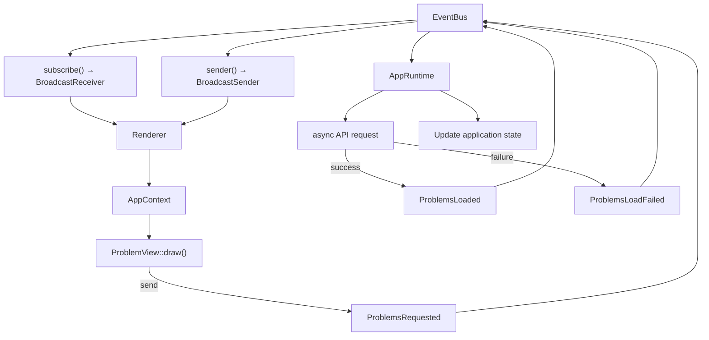

# Diagram

```mermaid
flowchart TD
    EB["EventBus"]

    EB --> RX["subscribe() → BroadcastReceiver"]
    EB --> TX["sender() → BroadcastSender"]

    RX --> R["Renderer"]
    TX --> R

    R --> AC["AppContext"]
    AC --> PV["ProblemView::draw()"]

    PV -->|send| PR["ProblemsRequested"]
    PR --> EB

    EB --> RT["AppRuntime"]
    RT --> API["async API request"]

    API -->|success| PL["ProblemsLoaded"]
    API -->|failure| PF["ProblemsLoadFailed"]

    PL --> EB
    PF --> EB

    RT --> S["Update application state"]
```
