# Rust Ownership

> **Core idea:** Rust's ownership system answers one question: **who is responsible for a value, and for how long?**

Ownership is not primarily about syntax. It is a set of rules governing **lifetime, mutation, borrowing, movement, and destruction** of values.

---

## 1. The Mental Model

Every value in Rust has:

- **An owner**
- **A lifetime**
- **A location in memory**
- **A way to access it**
- **A point at which it is destroyed**

The fundamental relationship is:

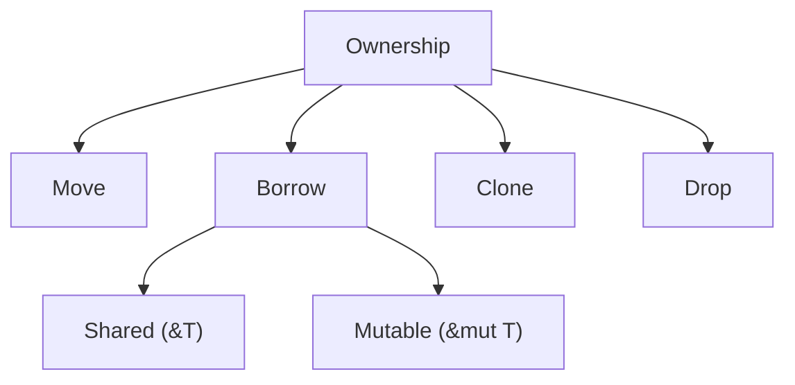

Rust enforces these relationships **at compile time**.

The three foundational ownership rules are:

1. **Every value has an owner.**
2. **There can only be one owner at a time.**
3. **When the owner goes out of scope, the value is dropped.**

Borrowing adds the access rules:

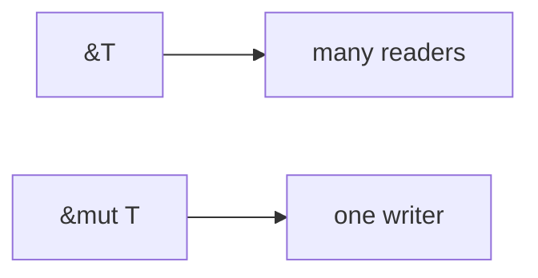

These cannot overlap in a way that permits data races.

---

## 2. Values, Bindings, and Owners

Consider:

```rust
let name = String::from("Alice");
```

There are two useful concepts here:

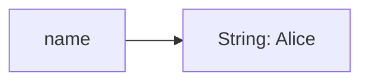

`name` is a **binding**.

The `String` is the **value**.

The binding owns the value.

Ownership therefore belongs to a **value**, while variables/bindings are one mechanism through which ownership is held.

---

## 3. Stack vs Heap

Ownership becomes especially important when values contain heap allocation.

### Stack value

```rust
let x = 42;
```

The simplified picture is:

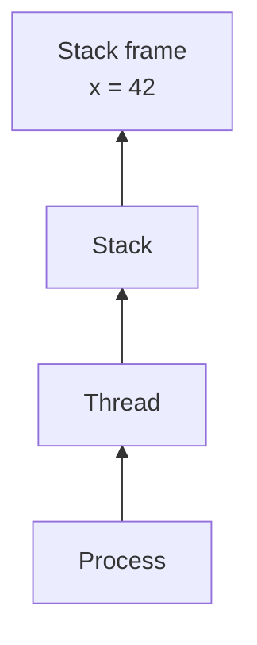

<details>

<summary>Click to view the broader process memory picture</summary>

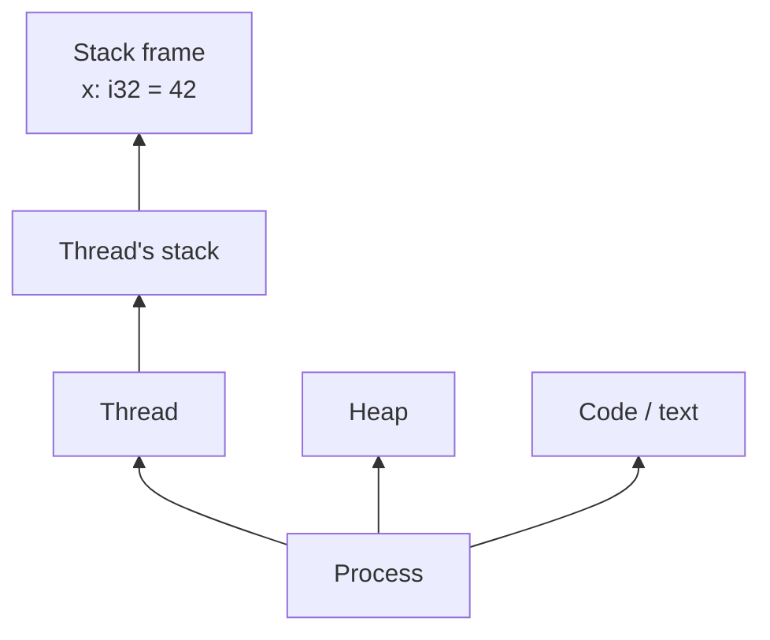

This simplified diagram focuses on the **stack hierarchy**: a process contains threads, each thread has its own stack, and the stack contains stack frames for active function calls.

The expanded diagram places the stack in the larger picture: the process also has regions such as the **heap** and **program code**, while each thread maintains its own stack.

</details>

### Heap-owning value

```rust
let name = String::from("Alice");
```

Conceptually:

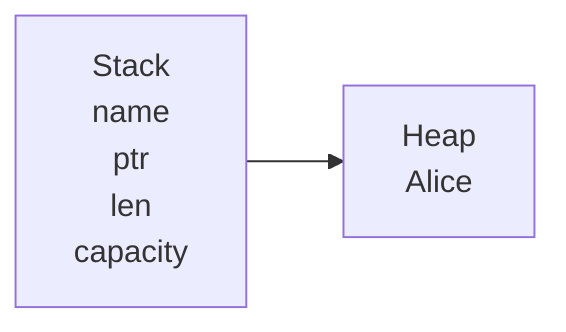

| Field      | Meaning                                                      |
| ---------- | ------------------------------------------------------------ |
| `ptr`      | Address pointing to the heap allocation containing `"Alice"` |
| `len`      | Number of bytes currently used by the string                 |
| `capacity` | Number of bytes allocated in the heap buffer                 |

<details>

<summary>Click to view the broader process memory picture</summary>

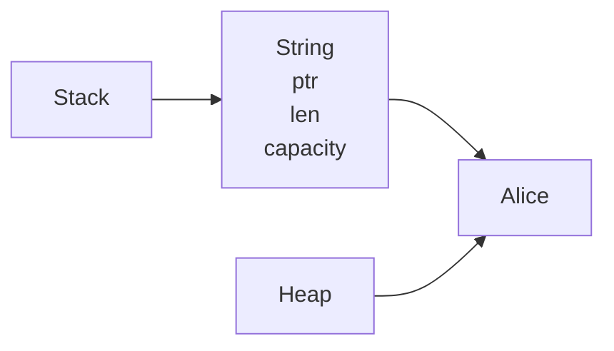

</details>

The `String` value itself lives on the stack, but it **owns an allocation on the heap**.

Ownership is what makes Rust know who is responsible for that allocation.

---

## 4. Move

A **move transfers ownership**.

```rust
let a = String::from("hello");

let b = a;
a = String::from("goodbye"); // ❌
```

The first statement creates a `String` and binds its ownership to `a`:

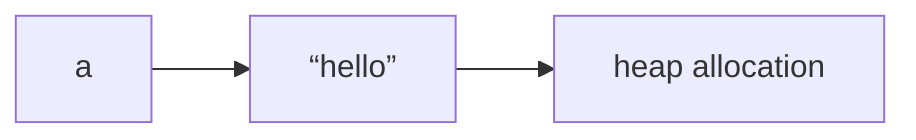

Then:

```rust
let b = a;
```

moves the value currently bound to `a` to `b`:

`a` is no longer usable:

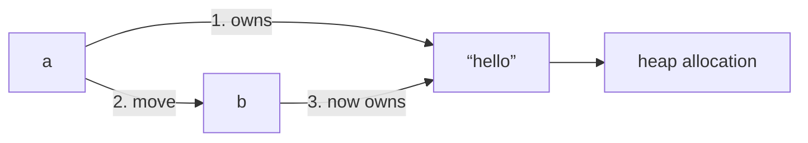

1. A owned "hello"
2. A moved to "B"
3. B now "owns" "hello"

Conceptually, you can think of it as:

```text
let a = String::from("hello");
│
├── a owns a String value
│   ├── ptr ──────────┐
│   ├── len = 5       │
│   └── capacity = 5  │
│                     ▼
│                 "hello"
│                 (heap)
│
let b = a;
│
└── ownership moves from a → b
```

```rust
println!("{b}"); // okay

println!("{a}"); // error
```

The important thing is that Rust does **not** need to copy the heap allocation. The `String`'s ownership is transferred to `b`; the underlying allocation remains where it is.

---

## 5. Copy

Some values implement `Copy`.

```rust
let a = 42;
let b = a;

println!("{a}");
println!("{b}");
```

Both remain valid.

The distinction is:

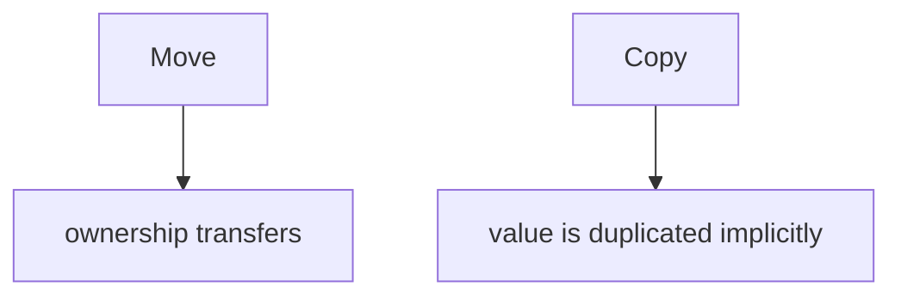

Primitive types such as integers, booleans, and characters are commonly `Copy`.

A type can implement `Copy` only when its contents can safely be duplicated by a simple bitwise copy.

---

## 6. Clone

`clone()` explicitly creates another value.

```rust
let a = String::from("hello");
let b = a.clone();
```

Now:

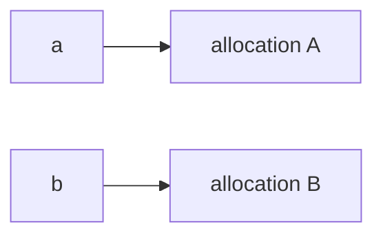

Unlike a move, cloning can require an actual allocation and data copy.

Therefore:

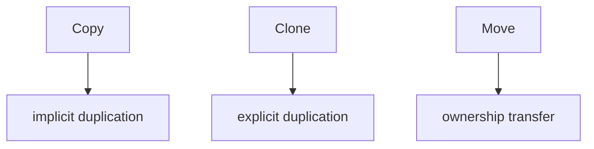

These are fundamentally different operations.

---

## 7. Drop

When an owner goes out of scope, Rust automatically **drops the value**.

```rust
{
    let name = String::from("Alice");

} // name goes out of scope
```

Conceptually:

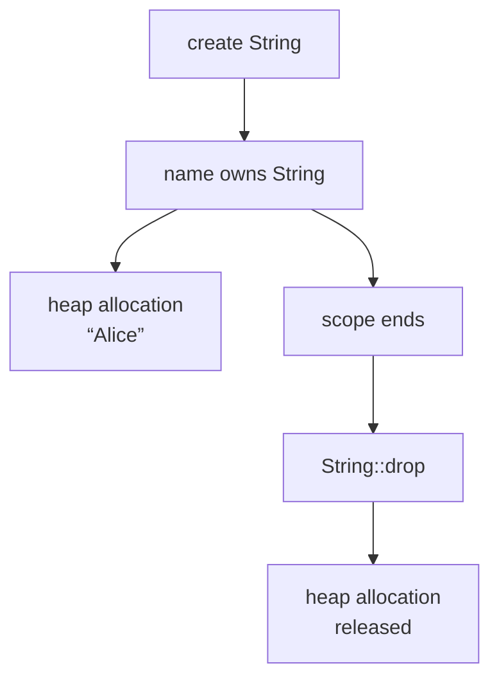

The important relationship is:

> **When the owner goes out of scope, the owned value is dropped.**

Dropping a value may release the resources associated with it.

This is the foundation of **RAII (Resource Acquisition Is Initialization)** in Rust.

Resources such as:

- heap allocations
- files
- sockets
- locks
- database connections
- OS handles

can be tied to object lifetime.

---

## 8. Scope

Ownership is closely related to scope.

```rust
fn example() {
    let a = String::from("hello");

    {
        let b = String::from("world");
    } // b dropped

} // a dropped
```

The lifetime of a local binding is generally bounded by its scope.

But **scope and lifetime are not identical concepts**.

A Rust lifetime is primarily about **how long a reference is valid**, whereas a scope describes where a binding is accessible.

---

## 9. Borrowing

Borrowing allows access to a value **without taking ownership**.

```rust
let name = String::from("Alice");

let reference = &name;
```

Ownership remains:

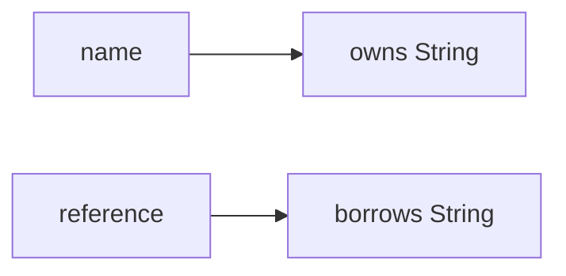

The reference does not destroy the value.

When `reference` disappears, `name` still owns the `String`.

---

## 10. Shared Borrow

`&T` creates a shared reference.

```rust
let name = String::from("Alice");

let a = &name;
let b = &name;
let c = &name;
```

Multiple shared references are allowed.

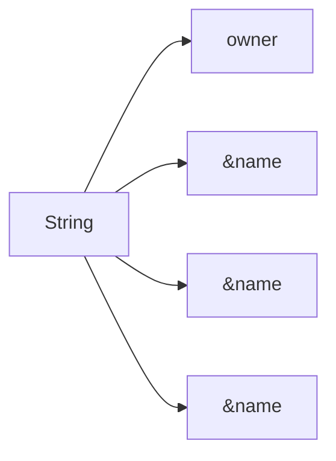

The rule is:

> **Many readers are allowed.**

---

## 11. Mutable Borrow

`&mut T` creates a mutable reference.

```rust
let mut name = String::from("Alice");

let reference = &mut name;
reference.push_str(" Smith");
```

A mutable borrow provides exclusive access.

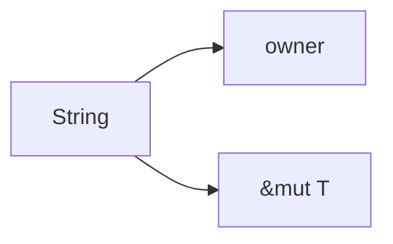

The rule is:

> **One writer is allowed.**

While a mutable reference is active, incompatible accesses are prohibited.

---

## 12. The Alias XOR Mutability Rule

The core borrowing rule can be expressed as:

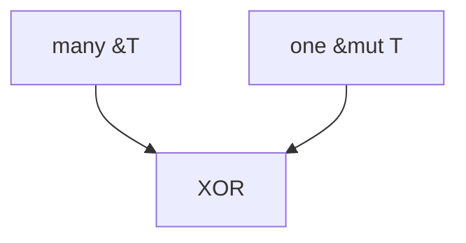

Not simultaneously.

That means:

```rust
&value
&value
&value
```

is valid.

And:

```rust
&mut value
```

is valid.

But:

```rust
&value
&mut value
```

cannot overlap.

This prevents data races and iterator invalidation-style bugs at compile time.

---

## 13. Borrowing Does Not Transfer Ownership

Compare:

```rust
fn consume(value: String) {}
```

with:

```rust
fn inspect(value: &String) {}
```

Calling:

```rust
let name = String::from("Alice");

consume(name);
// name moved
```

versus:

```rust
let name = String::from("Alice");

inspect(&name);
// name still owned here
```

The distinction is fundamental:

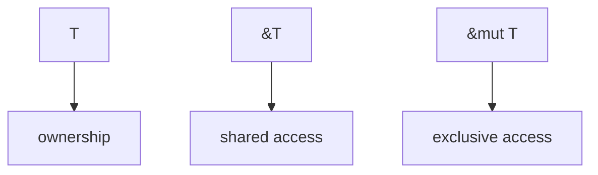

---

## 14. Function Parameters

Function parameters are one of the clearest ways to understand ownership.

### Take ownership

```rust
fn consume(value: String) {
    // owns value
}
```

Calling:

```rust
consume(name);
```

moves `name`.

### Borrow immutably

```rust
fn inspect(value: &String) {
    // temporarily borrows value
}
```

Calling:

```rust
inspect(&name);
```

does not transfer ownership.

### Borrow mutably

```rust
fn modify(value: &mut String) {
    value.push_str("!");
}
```

Calling:

```rust
modify(&mut name);
```

temporarily grants exclusive access.

---

## 15. Return Values Transfer Ownership

Ownership can move through function returns.

```rust
fn create() -> String {
    String::from("hello")
}

let value = create();
```

Conceptually:

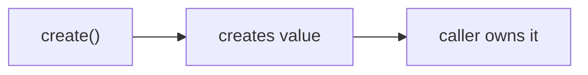

Likewise:

```rust
fn transform(value: String) -> String {
    value
}
```

Ownership enters the function and leaves the function.

---

## 16. `.into()`

`into()` commonly represents an ownership-consuming conversion.

```rust
let a = String::from("hello");
let b: Vec<u8> = a.into();
```

The important part is the receiver:

```rust
a.into()
```

`into()` takes `self`.

Conceptually:

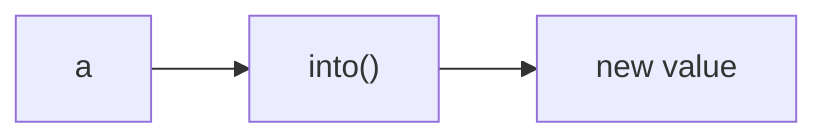

This is different from borrowing methods such as:

```rust
as_ref()
as_deref()
```

---

## 17. `.take()`

`take()` replaces a value with its default value and returns the original.

Most commonly:

```rust
let mut value = Some(String::from("hello"));

let old = value.take();
```

Afterward:

```mermaid
flowchart LR
    field["field"] --> old["old value -> caller"]
    field --> replacement["replacement -> Default"]
```

This is useful when ownership must be extracted from a field without moving the entire containing object.

Conceptually:

```mermaid
flowchart TD
    field["field"] --> old["old value"]
    field --> default["Default"]
    old --> caller["caller"]
```

---

## 18. `mem::take()`

`std::mem::take()` is the generalized form of the same idea.

```rust
let mut value = vec![1, 2, 3];

let old = std::mem::take(&mut value);
```

Afterward:

```mermaid
flowchart LR
    old["old"] --> arr["[1, 2, 3]"]
    value["value"] --> empty["[]"]
```

It requires:

```rust
T: Default
```

The operation is essentially:

```mermaid
flowchart TD
    val["value"] --> default["T::default()"]
    val --> old["return old value"]
```

---

## 19. `mem::replace()`

`replace()` lets you choose the replacement value.

```rust
let mut value = String::from("old");

let old = std::mem::replace(
    &mut value,
    String::from("new"),
);
```

Result:

```mermaid
flowchart LR
    old["old"] --> oldv["\"old\""]
    value["value"] --> newv["\"new\""]
```

The important ownership pattern is:

```mermaid
flowchart LR
    mutref["&mut value"] --> extract["extract old ownership"]
    mutref --> install["install new ownership"]
```

This is particularly useful when working with struct fields.

---

## 20. `.unwrap()`

`unwrap()` consumes an `Option<T>` or `Result<T, E>`.

```rust
let value = Some(String::from("hello"));

let string = value.unwrap();
```

The `Option` is consumed and the inner `String` is returned.

Conceptually:

```mermaid
flowchart LR
    opt["Option<String>"] --> unwrap["unwrap()"]
    unwrap --> owned["String"]
```

`unwrap()` is therefore an **ownership-consuming operation**.

---

## 21. `.drain()`

`drain()` creates an iterator that removes elements from a collection.

```rust
let mut values = vec![1, 2, 3];

for value in values.drain(..) {
    println!("{value}");
}
```

The elements are moved out of the collection.

Conceptually:

```mermaid
flowchart LR
    vec["Vec"] --> e1["element -> iterator"]
    vec --> e2["element -> iterator"]
    vec --> e3["element -> iterator"]
    vec --> empty["Vec becomes empty"]
```

This is different from:

```rust
iter()
```

which only borrows the elements.

---

## 22. `iter()`

`iter()` produces shared references.

```rust
for value in values.iter() {
    // value: &T
}
```

Conceptually:

```mermaid
flowchart LR
    vec["Vec<T>"] --> r1["&T"]
    vec --> r2["&T"]
    vec --> r3["&T"]
```

Nothing is moved out.

---

## 23. `iter_mut()`

`iter_mut()` produces mutable references.

```rust
for value in values.iter_mut() {
    *value += 1;
}
```

Conceptually:

```mermaid
flowchart LR
    vec["Vec<T>"] --> m1["&mut T"]
    vec --> m2["&mut T"]
    vec --> m3["&mut T"]
```

The collection retains ownership.

The iterator temporarily provides mutable access to its elements.

---

## 24. `into_iter()`

`into_iter()` consumes the collection and yields owned values.

```rust
let values = vec![1, 2, 3];

for value in values.into_iter() {
    // value: i32
}
```

Conceptually:

```mermaid
flowchart TD
    iter["iter()"] --> shared["&T"]
    iter_mut["iter_mut()"] --> unique["&mut T"]
    into_iter["into_iter()"] --> owned["T"]
```

This distinction is one of the most useful ownership patterns in Rust.

---

## 25. `as_ref()`

`as_ref()` generally converts ownership-oriented containers into containers of references.

For example:

```rust
let value = Some(String::from("hello"));

let reference = value.as_ref();
```

Now:

```mermaid
flowchart LR
    value["value -> owns String"] --> ref["reference -> borrows String"]
```

The original container remains usable.

---

## 26. `as_mut()`

`as_mut()` is the mutable equivalent.

```rust
let mut value = Some(String::from("hello"));

if let Some(value) = value.as_mut() {
    value.push('!');
}
```

```mermaid
flowchart LR
    option["Option<String>"] --> owner["owner"]
    option --> ref["&mut String"]
```

The `Option` remains the owner.

The returned value is a mutable reference into it.

---

## 27. `as_deref()`

`as_deref()` converts through `Deref`.

For example:

```rust
let value = Some(String::from("hello"));

let reference: Option<&str> = value.as_deref();
```

Conceptually:

```mermaid
flowchart LR
    owner["Option<String>"] --> deref["as_deref()"]
    deref --> borrowed["Option<&str>"]
```

This is particularly useful when APIs expect borrowed string slices instead of owned `String`s.

---

## 28. `.borrow()`

`borrow()` is associated with the `Borrow` trait and, importantly, is **not the same thing as creating a normal Rust reference with `&`**.

For example:

```rust
use std::borrow::Borrow;

let value = String::from("hello");

let reference: &str = value.borrow();
```

It expresses a conversion from an owned representation into a borrowed representation.

The broader concept is:

```mermaid
flowchart LR
    owned["owned representation"] --> borrow["borrow()"]
    borrow --> borrowed["borrowed representation"]
```

---

## 29. `.deref()`

`deref()` comes from the `Deref` trait.

```rust
use std::ops::Deref;

let value = Box::new(String::from("hello"));

let reference: &String = value.deref();
```

It exposes the target behind a dereferenceable type.

Usually, Rust's **deref coercion** makes explicit `.deref()` unnecessary:

```rust
fn inspect(value: &str) {}

let value = String::from("hello");

inspect(&value);
```

Rust can automatically convert:

```mermaid
flowchart LR
    s1["&String"] --> coercion["deref coercion"]
    coercion --> s2["&str"]
```

---

## 30. `.clone()` vs `.to_owned()`

These are related but conceptually different.

```rust
let a = String::from("hello");

let b = a.clone();
let c = a.to_owned();
```

`clone()` means:

> Create another instance of this value.

`to_owned()` means:

> Create an owned version of this borrowed value.

For example:

```rust
let slice: &str = "hello";

let owned: String = slice.to_owned();
```

A useful mental distinction:

```mermaid
flowchart TD
    clone["Clone"] --> dup["duplicate this value"]
    to_owned["ToOwned"] --> owned["create the owned form of a borrowed form"]
```

---

## 31. `.to_string()`

`to_string()` converts a displayable value into a `String`.

```rust
let value = 42;

let text = value.to_string();
```

For strings:

```rust
let slice: &str = "hello";
let owned = slice.to_string();
```

It creates owned data.

Thus:

```mermaid
flowchart LR
    s["&str"] --> to_string["to_string()"]
    to_string --> owned["String"]
```

---

## 32. `.to_vec()`

`to_vec()` creates an owned `Vec` from a slice.

```rust
let values: &[i32] = &[1, 2, 3];

let owned = values.to_vec();
```

Conceptually:

```mermaid
flowchart LR
    slice["&[T]"] --> vec["to_vec()"]
    vec --> owned["Vec<T>"]
```

The resulting vector owns its elements.

---

## 33. `Arc`

`Arc<T>` provides shared ownership across threads.

```rust
use std::sync::Arc;

let value = Arc::new(String::from("hello"));

let a = Arc::clone(&value);
let b = Arc::clone(&value);
```

Conceptually:

```mermaid
flowchart LR
    alloc["allocation"] --> a["Arc"]
    alloc --> b["Arc"]
```

The allocation remains alive until the final `Arc` owner disappears.

---

## 34. `Arc::clone()`

`Arc::clone()` does **not** deep-copy the underlying value.

```rust
let a = Arc::new(data);
let b = Arc::clone(&a);
```

Both point to the same allocation.

```mermaid
flowchart LR
    a["a"] --> shared["T"]
    b["b"] --> shared
```

Only the reference count is incremented.

This is fundamentally different from:

```rust
data.clone()
```

which may duplicate the actual data.

---

## 35. `Arc::try_unwrap()`

`try_unwrap()` attempts to recover ownership of the underlying value.

```rust
let value = Arc::new(String::from("hello"));

let owned = Arc::try_unwrap(value);
```

This succeeds only when there is a single strong owner.

Conceptually:

```mermaid
flowchart TD
    arc["Arc<T>"] --> one["one owner -> T"]
    arc --> many["many owners -> cannot unwrap"]
```

This expresses:

> "I want ownership back, but only if nobody else owns this value."

---

## 36. `Box`

`Box<T>` provides unique ownership of a heap allocation.

```rust
let value = Box::new(String::from("hello"));
```

Conceptually:

```mermaid
flowchart LR
    box["Box"] --> heap["owns heap allocation"]
```

Unlike `Arc`, a `Box` has a single owner.

---

## 37. `Box::into_inner`

`Box::into_inner` consumes the `Box` and returns the owned value.

Conceptually:

```mermaid
flowchart LR
    box["Box<T>"] --> into["into_inner()"]
    into --> owned["T"]
```

Ownership moves from the heap allocation into the returned value.

---

## 38. `Box::leak`

`Box::leak()` intentionally turns an owned heap allocation into a reference that can live for an arbitrarily long lifetime, commonly `'static`.

```rust
let value = Box::new(String::from("hello"));

let reference: &'static String = Box::leak(value);
```

Conceptually:

```mermaid
flowchart LR
    box["Box<T>"] --> leak["leak()"]
    leak --> staticref["&'static T"]
```

The allocation is no longer automatically reclaimed through the original `Box`.

This is therefore an **intentional ownership escape**.

---

## 39. Lifetimes

A lifetime describes the period during which a reference is valid.

```rust
fn inspect<'a>(value: &'a String) -> &'a String {
    value
}
```

`'a` connects the input reference and output reference.

It says:

```mermaid
flowchart LR
    in["input reference"] --> a["'a"]
    out["output reference"] --> a
    a --> rule["cannot outlive source reference"]
```

Lifetimes do not normally represent how long the owned value itself exists.

They primarily describe **relationships between references**.

---

## 40. `'static`

`'static` means a reference can remain valid for the entire program lifetime.

```rust
let value: &'static str = "hello";
```

String literals are `'static` because they are embedded in the program's binary.

But:

```mermaid
flowchart TD
    static["'static"] --> meaning["reference valid for entire program lifetime"]
```

does **not** simply mean:

> "This value is permanent."

It means:

> "This reference is valid for the entire program lifetime."

An owned value can also be moved into a `'static` context without itself being a `'static` reference.

---

## 41. Lifetime Elision

Rust often infers lifetimes automatically.

Instead of:

```rust
fn inspect<'a>(value: &'a str) -> &'a str {
    value
}
```

you can write:

```rust
fn inspect(value: &str) -> &str {
    value
}
```

The compiler applies lifetime-elision rules.

Explicit lifetime annotations are primarily necessary when Rust needs help understanding **relationships between references**.

---

## 42. Ownership vs Borrowing

The cleanest distinction is:

```mermaid
flowchart TD
    ownership["OWNERSHIP"] --> text1["I am responsible for this value."]
    borrowing["BORROWING"] --> text2["I temporarily have access to this value."]
    move["MOVE"] --> text3["I transfer responsibility."]
    clone["CLONE"] --> text4["I create another value."]
    drop["DROP"] --> text5["I finish responsibility."]
    ref["REFERENCE"] --> text6["I have access without responsibility."]
```

---

## 43. Consuming vs Borrowing Methods

A useful way to inspect an unfamiliar API is to ask:

> **Does this method take `self`, `&self`, or `&mut self`?**

### `self`

Consumes ownership.

```rust
fn consume(self)
```

Think:

```mermaid
flowchart LR
    self["self"] --> method["ownership -> method"]
```

Examples:

```text
into()
unwrap()
into_iter()
```

### `&self`

Borrows immutably.

```rust
fn inspect(&self)
```

Think:

```mermaid
flowchart LR
    ownership["ownership"] --> read["temporary read access"]
```

Examples:

```text
len()
iter()
as_ref()
```

### `&mut self`

Borrows mutably.

```rust
fn modify(&mut self)
```

Think:

```mermaid
flowchart LR
    ownership["ownership"] --> write["temporary exclusive access"]
```

Examples:

```text
iter_mut()
as_mut()
```

This is one of the most powerful ways to understand Rust APIs.

---

## 44. A Method Receiver Cheat Sheet

```mermaid
flowchart TD
    self["self"] --> consume["consumes ownership"]
    ref["&self"] --> shared["shared borrow"]
    mutref["&mut self"] --> mutable["mutable borrow"]
```

And therefore:

```mermaid
flowchart TD
    a["foo.into()"] --> cons["likely consumes foo"]
    b["foo.as_ref()"] --> sh["likely borrows foo"]
    c["foo.as_mut()"] --> mut["likely mutably borrows foo"]
    d["foo.iter()"] --> borrow["borrows elements"]
    e["foo.iter_mut()"] --> mutel["mutably borrows elements"]
    f["foo.into_iter()"] --> own["consumes foo"]
```

---

## 45. Ownership Extraction

Many Rust APIs exist because you cannot simply move a field out of a borrowed structure.

Consider:

```rust
struct State {
    value: String,
}
```

Given:

```rust
fn take_value(state: &mut State) -> String {
    // cannot simply move state.value out
}
```

You can instead replace it:

```rust
fn take_value(state: &mut State) -> String {
    std::mem::take(&mut state.value)
}
```

The pattern is:

```mermaid
flowchart TD
    borrow["borrow structure mutably"] --> own["temporarily own field"]
    own --> valid["leave valid replacement behind"]
```

This pattern appears constantly in real Rust code.

---

## 46. Ownership and Collections

Collections make ownership particularly visible.

```rust
let mut values = vec![
    String::from("a"),
    String::from("b"),
];
```

The vector owns its elements:

```mermaid
flowchart LR
    vec["Vec"] --> s1["owns String"]
    vec --> s2["owns String"]
```

Then:

```rust
values.iter()
```

gives:

```text
&String
```

while:

```rust
values.iter_mut()
```

gives:

```text
&mut String
```

and:

```rust
values.into_iter()
```

gives:

```text
String
```

The entire distinction is:

```mermaid
flowchart TD
    iter["iter()"] --> borrow["borrow"]
    iter_mut["iter_mut()"] --> mutborrow["mutable borrow"]
    into_iter["into_iter()"] --> own["ownership"]
```

---

## 47. Dereferencing

If:

```rust
let value = 42;
let reference = &value;
```

then:

```rust
*reference
```

accesses the value behind the reference.

Conceptually:

```mermaid
flowchart LR
    reference["reference"] --> value["value"]
```

`&` creates a reference.

`*` dereferences one.

```mermaid
flowchart LR
    t["&T"] --> d["* -> T"]
```

In expressions, Rust automatically inserts some borrowing and dereferencing through coercion and method lookup.

---

## 48. Ownership Through Smart Pointers

Rust's pointer types encode different ownership models.

```mermaid
flowchart TD
    box["Box<T>"] --> boxo["one owner"]
    rc["Rc<T>"] --> rco["shared ownership, single-threaded"]
    arc["Arc<T>"] --> arcc["shared ownership, thread-safe"]
    shared["&T"] --> sh["borrowed access"]
    mut["&mut T"] --> mu["exclusive borrowed access"]
```

These are not merely different pointer implementations.

They represent different **ownership semantics**.

---

## 49. `Rc::clone()` vs `Arc::clone()`

Both create another owner without cloning the underlying `T`.

```rust
let a = Rc::new(value);
let b = Rc::clone(&a);
```

and:

```rust
let a = Arc::new(value);
let b = Arc::clone(&a);
```

Conceptually:

```mermaid
flowchart LR
    rc["Rc<T> / Arc<T>"] --> owner1["owner"]
    rc --> owner2["owner"]
    owner1 --> shared["shared T"]
    owner2 --> shared
```

The difference is primarily the environment in which ownership is safe:

```mermaid
flowchart TD
    rc["Rc"] --> single["single-threaded"]
    arc["Arc"] --> safe["thread-safe sharing"]
```

---

## 50. Ownership Conversion Vocabulary

A useful vocabulary map:

```mermaid
flowchart TD
    move["MOVE"] --> m1["into()"]
    move --> m2["unwrap()"]
    move --> m3["into_iter()"]
    move --> m4["drain()"]
    move --> m5["Box::into_inner()"]
    move --> m6["Arc::try_unwrap()"]

    copy["COPY"] --> c1["implicit for Copy types"]

    clone["CLONE"] --> cl1["clone()"]
    clone --> cl2["Rc::clone()"]
    clone --> cl3["Arc::clone()"]

    borrow["BORROW"] --> b1["&value"]
    borrow --> b2["iter()"]
    borrow --> b3["as_ref()"]
    borrow --> b4["borrow()"]
    borrow --> b5["deref()"]

    mutborrow["MUTABLY BORROW"] --> mb1["&mut value"]
    mutborrow --> mb2["iter_mut()"]
    mutborrow --> mb3["as_mut()"]

    create["CREATE OWNED VALUE"] --> cr1["to_owned()"]
    create --> cr2["to_string()"]
    create --> cr3["to_vec()"]

    replace["REPLACE OWNED VALUE"] --> r1["mem::take()"]
    replace --> r2["mem::replace()"]
    replace --> r3["Option::take()"]

    escape["ESCAPE OWNERSHIP"] --> e1["Box::leak()"]
```

---

## 51. The Fundamental Question

When reading Rust code, do not initially ask:

> "What does this syntax do?"

Ask:

> **"What happens to ownership here?"**

For every operation, classify it:

```mermaid
flowchart TD
    q["Does it..."] --> m["Move the value?"]
    q --> c["Copy the value?"]
    q --> cl["Clone the value?"]
    q --> b["Borrow the value?"]
    q --> mb["Mutably borrow the value?"]
    q --> con["Consume the owner?"]
    q --> ext["Extract ownership from somewhere?"]
    q --> new["Create a new owner?"]
    q --> replace["Replace an existing value?"]
    q --> life["Extend a reference's lifetime?"]
    q --> drop["Drop a value?"]
```

Once this becomes automatic, much of Rust's syntax becomes predictable.

---

## 52. The Ownership Lifecycle

A value can be understood as moving through this lifecycle:

```mermaid
flowchart TD
    create["CREATE"] --> own["OWNERSHIP"]
    own --> move["MOVE"]
    own --> borrow["BORROW"]
    own --> clone["CLONE"]

    borrow --> shared["&T"]
    borrow --> unique["&mut T"]

    move --> newowner["NEW OWNER"]
    clone --> newvalue["NEW VALUE"]

    shared --> drop["DROP"]
    unique --> drop
    newowner --> drop
    newvalue --> drop
```

The compiler's job is largely to ensure that these transitions are valid.

---

## 53. The Three Questions

When confused by Rust ownership, reduce the problem to three questions:

### 1. Who owns this value?

```mermaid
flowchart TD
    q1["Who owns this value?"] --> var["variable?"]
    q1 --> field["struct field?"]
    q1 --> box["Box?"]
    q1 --> rc["Rc?"]
    q1 --> arc["Arc?"]
```

### 2. Who currently has access?

```mermaid
flowchart TD
    q2["Who currently has access?"] --> owner["owner?"]
    q2 --> shared["&T?"]
    q2 --> mut["&mut T?"]
```

### 3. When does that access end?

```mermaid
flowchart TD
    q3["When does that access end?"] --> scope["scope?"]
    q3 --> last["last use?"]
    q3 --> lifetime["explicit lifetime relationship?"]
```

If you can answer those three questions, most borrow-checker errors become understandable.

---

## 54. The Core Model

The entire ownership system can be compressed into this:

```mermaid
flowchart TD
    value["VALUE"] --> owned["OWNED"]
    value --> borrowed["BORROWED"]

    owned --> unique["unique"]
    owned --> shared["shared"]

    unique --> box["Box"]
    shared --> rc["Rc/Arc"]

    borrowed --> ref["&T"]
    borrowed --> mutref["&mut T"]

    box --> drop["Drop"]
    rc --> drop
```

Or, more simply:

```mermaid
flowchart TD
    O["Ownership"] --> M["Move"]
    O --> B["Borrow"]
    O --> C["Clone"]

    B --> S["&T"]
    B --> U["&mut T"]

    S --> SH["shared"]
    U --> EX["exclusive"]

    M --> D["Drop"]
    C --> D
```

> **Rust's ownership system is fundamentally a system for controlling who may access a value, who is responsible for destroying it, and how those responsibilities move over time.**
