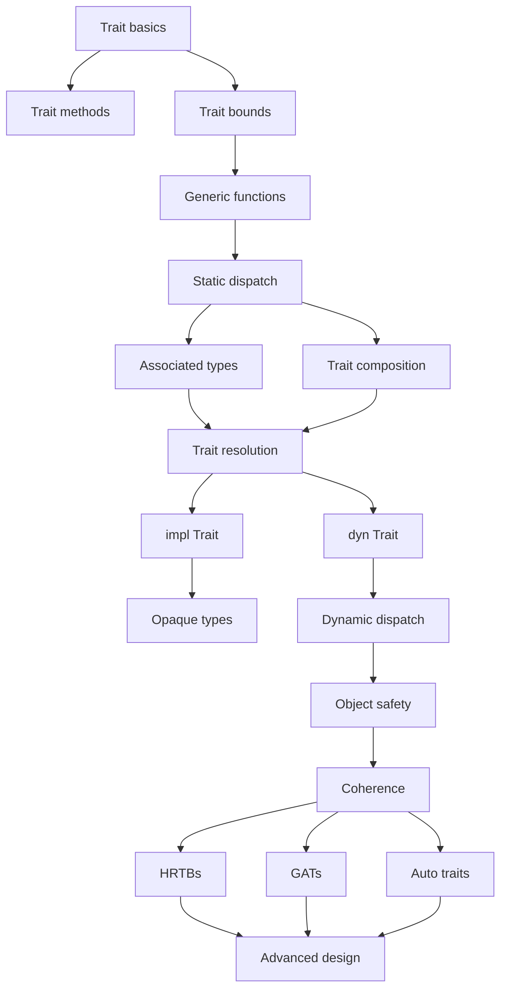

# TRAITS

```sh
Traits
│
├── 1. Capability
│ "What can this type do?"
│
├── 2. Constraints
│ "What must this type be able to do?"
│
├── 3. Generic abstraction
│ "Can I preserve the concrete type?"
│
├── 4. Dispatch
│ "When/how is the implementation selected?"
│
├── 5. Associated types
│ "What types belong to this behavior?"
│
├── 6. Composition
│ "How do behaviors depend on other behaviors?"
│
├── 7. Dynamic abstraction
│ "Can I erase the concrete type?"
│
├── 8. Resolution
│ "Which implementation/method does Rust mean?"
│
├── 9. Coherence
│ "Who is allowed to implement what?"
│
└── 10. Advanced trait systems
    GATs / HRTBs / auto traits / async / etc.
```

## Sections

```sh
traits/
├── 00_foundations
│ ├── 1_what_is_a_trait
│ ├── 2_traits_as_capabilities
│ ├── 3_implementing_traits
│ ├── 4_trait_methods
│ └── 5_trait_bounds
│
├── 01_trait_bounds
│ ├── 1_generic_bounds
│ ├── 2_where_clauses
│ ├── 3_multiple_bounds
│ ├── 4_nested_bounds
│ ├── 5_bounds_on_impl
│ └── 6_bounds_on_associated_items
│
├── 02_generic_dispatch
│ ├── 1_static_dispatch
│ ├── 2_monomorphization
│ ├── 3_trait_resolution
│ ├── 4_generic_functions
│ ├── 5_generic_structs
│ └── 6_generic_impls
│
├── 03_trait_composition
│ ├── 1_supertraits
│ ├── 2_trait_composition
│ ├── 3_multiple_traits
│ ├── 4_default_methods
│ ├── 5_overriding_defaults
│ └── 6_trait_design
│
├── 04_associated_items
│ ├── 1_associated_functions
│ ├── 2_associated_constants
│ ├── 3_associated_types
│ ├── 4_associated_type_vs_generic_parameter
│ ├── 5_multiple_impls
│ └── 6_output_types
│
├── 05_trait_objects
│ ├── 1_dyn_trait
│ ├── 2_trait_objects
│ ├── 3_dynamic_dispatch
│ ├── 4_static_vs_dynamic_dispatch
│ ├── 5_box_dyn_trait
│ ├── 6_reference_dyn_trait
│ └── 7_trait_object_storage
│
├── 06_object_safety
│ ├── 1_what_makes_a_trait_dyn_compatible
│ ├── 2_self_sized
│ ├── 3_generic_methods
│ ├── 4_returning_self
│ ├── 5_associated_types
│ └── 6_designing_dyn_compatible_traits
│
├── 07_trait_resolution
│ ├── 1_method_lookup
│ ├── 2_dot_operator
│ ├── 3_inherent_vs_trait_methods
│ ├── 4_disambiguating_methods
│ ├── 5_fully_qualified_syntax
│ └── 6_trait_in_scope
│
├── 08_blanket_impls
│ ├── 1_impl_for_all_types
│ ├── 2_trait_bounds_on_impl
│ ├── 3_conditional_implementations
│ ├── 4_trait_derived_behavior
│ └── 5_blanket_impl_patterns
│
├── 09_operator_traits
│ ├── 1_add
│ ├── 2_index
│ ├── 3_deref
│ ├── 4_call_operator
│ ├── 5_comparison_traits
│ └── 6_operator_design
│
├── 10_standard_traits
│ ├── 1_clone_copy
│ ├── 2_debug_display
│ ├── 3_default
│ ├── 4_from_into
│ ├── 5_asref_borrow
│ ├── 6_iterator_intoiterator
│ ├── 7_drop
│ └── 8_hash_eq_ord
│
├── 11_conversion_and_coercion
│ ├── 1_from_into
│ ├── 2_tryfrom_tryinto
│ ├── 3_asref_asmut
│ ├── 4_borrow_borrowmut
│ ├── 5_deref_coercion
│ └── 6_conversion_api_design
│
├── 12_iterators_and_traits
│ ├── 1_iterator_trait
│ ├── 2_associated_item_next
│ ├── 3_iterator_adaptors
│ ├── 4_intoiterator
│ ├── 5_double_ended_iterator
│ └── 6_custom_iterators
│
├── 13_lifetimes_and_traits
│ ├── 1_trait_bounds_with_lifetimes
│ ├── 2_borrowed_trait_objects
│ ├── 3_trait_object_lifetimes
│ ├── 4_hrtb
│ ├── 5_for_lifetimes
│ └── 6_trait_bounds_and_outliving
│
├── 14_advanced_bounds
│ ├── 1_sized
│ ├── 2_unsized
│ ├── 3_self_sized
│ ├── 4_hrtb
│ ├── 5_impl_trait
│ ├── 6_trait_alias_concepts
│ └── 7_where_bound_design
│
├── 15_impl_trait
│ ├── 1_impl_trait_parameters
│ ├── 2_impl_trait_returns
│ ├── 3_opaque_types
│ ├── 4_impl_trait_vs_dyn_trait
│ └── 5_returning_iterators
│
├── 16_async_traits
│ ├── 1_async_methods
│ ├── 2_async_trait_bounds
│ ├── 3_send_sync
│ ├── 4_dyn_async_traits
│ └── 5_async_trait_design
│
├── 17_gats
│ ├── 1_generic_associated_types
│ ├── 2_lending_patterns
│ ├── 3_gat_lifetimes
│ ├── 4_gat_trait_bounds
│ └── 5_gat_design
│
├── 18_auto_traits
│ ├── 1_send
│ ├── 2_sync
│ ├── 3_auto_trait_inference
│ ├── 4_negative_impls
│ └── 5_thread_safety_traits
│
├── 19_orphan_rules
│ ├── 1_coherence
│ ├── 2_orphan_rule
│ ├── 3_newtype_pattern
│ ├── 4_foreign_traits
│ └── 5_foreign_types
│
├── 20_proc_macros_and_derived_traits
│ ├── 1_derive
│ ├── 2_derive_macros
│ ├── 3_custom_derive
│ └── 4_trait_generation
│
├── 21_trait_architecture
│ ├── 1_trait_as_interface
│ ├── 2_trait_as_behavior
│ ├── 3_trait_as_constraint
│ ├── 4_trait_as_extension
│ ├── 5_trait_as_abstraction_boundary
│ ├── 6_generic_vs_trait_object
│ └── 7_designing_good_traits
│
└── 22_mastery
├── 1_reading_complex_bounds
├── 2_trait_resolution_problems
├── 3_dispatch_problems
├── 4_object_safety_problems
├── 5_associated_type_problems
├── 6_coherence_problems
├── 7_lifetime_trait_problems
└── 8_trait_architecture
```


