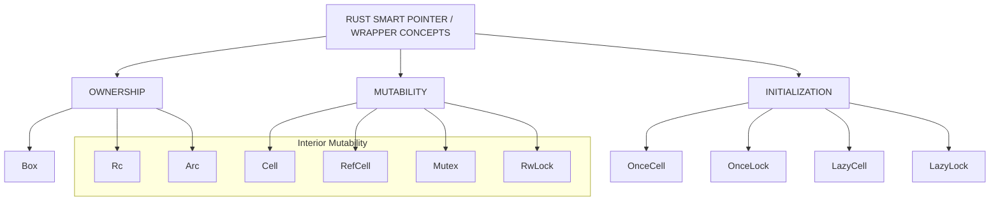

[Box]: "Can I store this data on the heap instead of the stack, or give it a fixed, known size for recursive types and trait objects?"
[Rc (Reference Counting)]: "Can multiple parts of my single-threaded code share ownership of this data without copying it?"
[Arc (Atomic Reference Counting)]: "Can multiple threads safely share ownership of this data concurrently?"
[Cow (Clone on Write)]: "Can I avoid allocating or cloning data unless I actually need to mutate it?"



OWNERSHIP

Box<T>
single owner

Rc<T>
multiple owners, same thread

Arc<T>
multiple owners, multiple threads

INTERIOR MUTABILITY

Cell<T>
mutate by replacing/getting values

RefCell<T>
runtime borrow checking

Mutex<T>
thread-safe exclusive access

RwLock<T>
thread-safe shared/exclusive access

BORROWED ↔ OWNED

Cow<'a, T>
borrowed until mutation requires ownership

ONE-TIME INITIALIZATION

OnceCell<T>
initialize once, single-threaded

OnceLock<T>
initialize once, thread-safe

LazyCell<T, F>
initialize once, lazily, single-threaded

LazyLock<T, F>
initialize once, lazily, thread-safe

```rust
#![allow(warnings)]
use std::mem;

#[derive(Debug, Clone, Copy)]
struct Point {
    x: f64,
    y: f64,
}

// A Rectangle can be specified by where its top left and bottom right
// corners are in space
#[allow(dead_code)]
struct Rectangle {
    top_left: Point,
    bottom_right: Point,
}

fn origin() -> Point {
    Point { x: 0.0, y: 0.0 }
}

fn boxed_origin() -> Box<Point> {
    // Allocate this point on the heap, and return a pointer to it
    Box::new(Point { x: 0.0, y: 0.0 })
}

fn main() {
    // (all the type annotations are superfluous)
    // Stack allocated variables
    let point: Point = origin();
    let rectangle: Rectangle = Rectangle {
        top_left: origin(),
        bottom_right: Point { x: 3.0, y: -4.0 }
    };

    // Heap allocated rectangle
    let boxed_rectangle: Box<Rectangle> = Box::new(Rectangle {
        top_left: origin(),
        bottom_right: Point { x: 3.0, y: -4.0 },
    });

    // The output of functions can be boxed
    let boxed_point: Box<Point> = Box::new(origin());

    // Double indirection
    let box_in_a_box: Box<Box<Point>> = Box::new(boxed_origin());

    println!("Point occupies {} bytes on the stack",
             mem::size_of_val(&point));
    println!("Rectangle occupies {} bytes on the stack",
             mem::size_of_val(&rectangle));

    // box size == pointer size
    println!("Boxed point occupies {} bytes on the stack",
             mem::size_of_val(&boxed_point));
    println!("Boxed rectangle occupies {} bytes on the stack",
             mem::size_of_val(&boxed_rectangle));
    println!("Boxed box occupies {} bytes on the stack",
             mem::size_of_val(&box_in_a_box));

    // Copy the data contained in `boxed_point` into `unboxed_point`
    let unboxed_point: Point = *boxed_point;
    println!("Unboxed point occupies {} bytes on the stack",
             mem::size_of_val(&unboxed_point));
}
```
