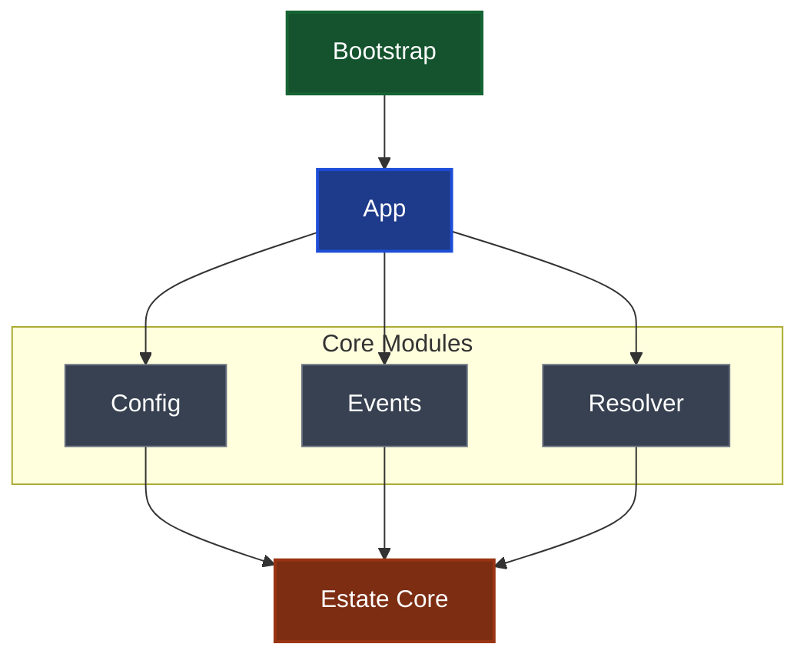

Estate's long-running application and runtime layer.
# Stuff

The daemon coordinates Estate's services, configuration, lifecycle,
event handling, and runtime state. It provides the application boundary
between Estate's core domain and long-running frontends such as the CLI,
background daemon process, and future integrations.

## Responsibilities

The daemon layer is responsible for:

- **Application lifecycle** — initializing, starting, reloading, and
  stopping Estate services.
- **Configuration** — loading and resolving runtime configuration.
- **Events** — coordinating events between long-running services.
- **Projections** — maintaining derived runtime views of Estate state.
- **Resolution** — resolving runtime resources and dependencies.
- **Shell integration** — interacting with the host environment.
- **Linting** — running project and Estate-level lint operations.

## Architecture

The daemon is organized into several layers of responsibility:

```text
                ┌───────────┐
                │ Bootstrap │
                └─────┬─────┘
                      │
                ┌─────▼─────┐
                │    App    │
                └─────┬─────┘
                      │
         ┌────────────┼────────────┐
         │            │            │
     ┌───▼───┐    ┌───▼───┐    ┌───▼────┐
     │ Config│    │ Events│    │Resolver│
     └───┬───┘    └───┬───┘    └───┬────┘
         │            │            │
         └────────────┼────────────┘
                      │
                ┌─────▼─────┐
                │Estate Core│
                └───────────┘
```


## Lifecycle

A typical daemon lifecycle is:

```text
initialize → start → run → reload → stop
```

[`initialize`] prepares the runtime environment and dependencies.
[`start`] begins the daemon's active services.
[`reload`] refreshes runtime state or configuration without requiring a
complete restart.

## Modules

- [`app`] — application-level daemon state and orchestration.
- [`bootstrap`] — runtime bootstrap and dependency initialization.
- [`config`] — daemon configuration.
- [`daemon`] — daemon process and lifecycle implementation.
- [`event`] — runtime event definitions and handling.
- [`initialize`] — initialization of daemon state and services.
- [`lint`] — linting operations.
- [`projection`] — derived views and projections of Estate state.
- [`reload`] — runtime reload operations.
- [`resolver`] — runtime resource and dependency resolution.
- [`shell`] — host shell and environment integration.
- [`start`] — daemon startup operations.

## Public API

Commonly used daemon types are re-exported from this module so consumers
can access the primary API without depending on the internal module
layout.

For example:

```ignore
use estate::daemon::EstateDaemon;
```

The module structure is intentionally subject to change while the daemon
architecture is being refined. Consumers should prefer the re-exported
API where possible.
